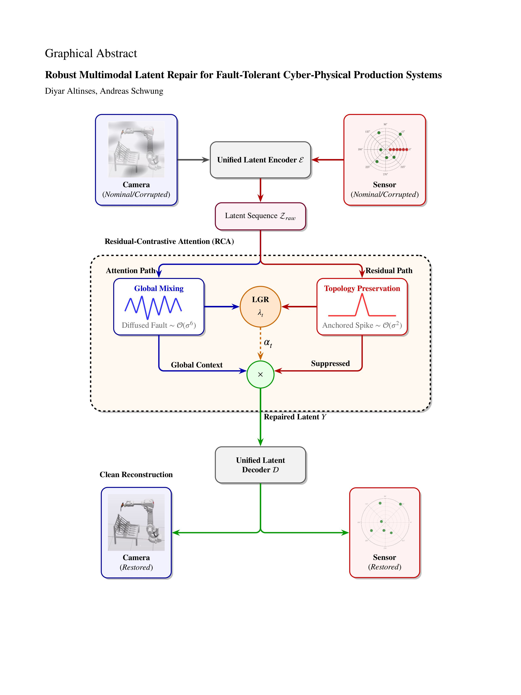

# Robust Multimodal Latent Repair (MMRCA) 🏭🤖

[](#) [](#datasets)
[](LICENSE)
[](https://www.python.org/)
[](https://pytorch.org/)

> **Robust Multimodal Latent Repair for Fault-Tolerant Cyber-Physical Production Systems**
> 

This repository contains the official implementation of the **Multimodal Residual-Contrastive Attention (MMRCA)** framework. Our model provides a mathematically grounded, deterministic approach to detecting and repairing signal-dependent sensor failures in industrial multimodal fusion systems.




## 📖 Abstract
Multimodal fusion systems in industrial environments are critically vulnerable to sensor faults that destabilize downstream tasks. We introduce a mathematically grounded framework that fundamentally re-engineers the Transformer block for fault tolerance. By proving that residual connections preserve fault locality while attention heads diffuse it, we introduce the **Residual-Contrastive Attention (RCA)** module. Using a novel Local-Global Ratio (LGR) to detect anomalies and an Inverse-Residual Gate to suppress them, our method accurately localizes faults without external supervision and reconstructs corrupted tokens purely from global context.

## ✨ Key Features
* **Active Latent Repair:** Moves beyond implicit regularization ("black-box" robustness) to deterministic, token-level fault inpainting.
* **Residual-Contrastive Attention (RCA):** Exploit the spectral divergence between residual (local) and attention (global) paths.
* **Unsupervised Anomaly Detection:** Utilizes the Local-Global Ratio (LGR) to achieve a 98.8% F1-score in detecting sensor failures.
* **Industrial Validation:** Validated on rigorous digital twins of robotic assembly and welding stations.

## 🏗️ Architecture Overview
The pipeline consists of four main stages:
1. **Failure Injection:** Simulates realistic mechanical/occlusion faults on a single modality.
2. **Unified Encoding:** Projects diverse data streams (spatial camera + kinematic sensors) into a shared latent space.
3. **Residual-Contrastive Repair (RCA):** The core module. It calculates the LGR to generate an anomaly score ($\alpha_t$) and uses an Inverse-Residual Gate to dynamically suppress the corrupted residual path, replacing it with amplified global context.
4. **Clean Reconstruction:** Decodes the repaired latent sequence back into the original clean signal manifolds.

## 💾 Datasets
The industrial digital twin datasets used in this study are openly available on Zenodo. Please download them and place them in the `data/` directory.

| Dataset | Modalities | Zenodo Link |
| :--- | :--- | :--- |
| **MuJoCo Environment** | Image + Kinematic | [10.5281/zenodo.14041621](https://doi.org/10.5281/zenodo.14041621) |
| **ABB Single Robot Station** | Image + Kinematic | [10.5281/zenodo.14041487](https://doi.org/10.5281/zenodo.14041487) |
| **ABB Dual Robot Station** | Image + Kinematic | [10.5281/zenodo.14041415](https://doi.org/10.5281/zenodo.14041415) |


## 📊 Results Summary

Our MMRCA framework significantly outperforms established baselines (MMAE, MMVAE, MMUGAN, etc.) particularly in recovering complex kinematic sensor data under severe corruption:

| Dataset | Camera Error (10⁻²) | Sensor Error (10⁻²) | Combined Error (10⁻²) |
| :--- | :--- | :--- | :--- |
| **MuJoCo** | 0.141 ± 0.010 | **0.527 ± 0.046** | **0.668 ± 0.041** |
| **ABB Single** | 0.097 ± 0.002 | **0.520 ± 0.115** | **0.617 ± 0.117** |
| **ABB Dual** | 0.090 ± 0.005 | **0.824 ± 0.165** | **0.915 ± 0.167** |

*See Section 5 of the paper for the comprehensive comparative analysis.*

## 📜 Citation

If you find this code or our theoretical framework useful in your research, please consider citing our paper:

```bibtex
@article{altinses_mmrca_2026,
  title={Robust Multimodal Latent Repair for Fault-Tolerant Cyber-Physical Production Systems},
  author={Altinses, Diyar and Schwung, Andreas},
  journal={Journal of Manufacturing Systems},
  year={2026},
  doi={XXXX}
}
```

## 🤝 License

This project is licensed under the MIT License - see the [LICENSE](https://www.google.com/search?q=LICENSE) file for details.

